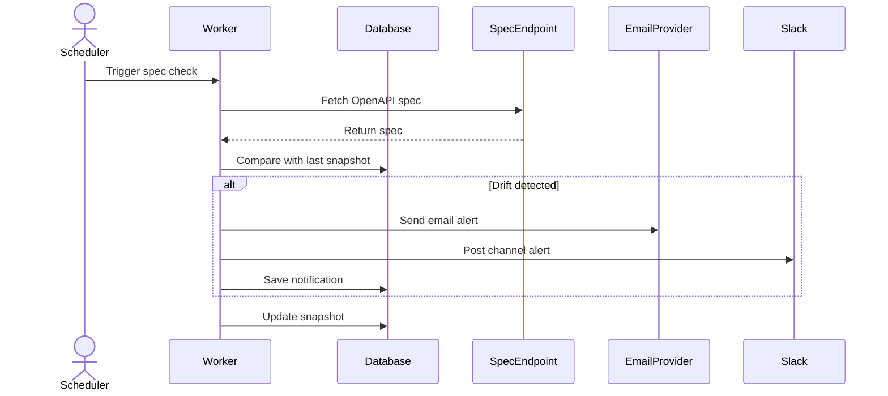
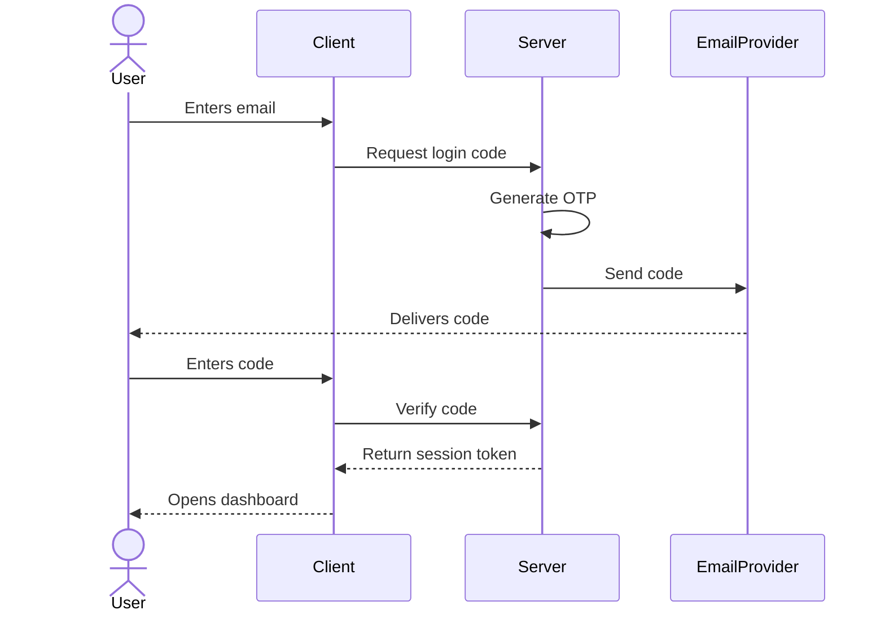
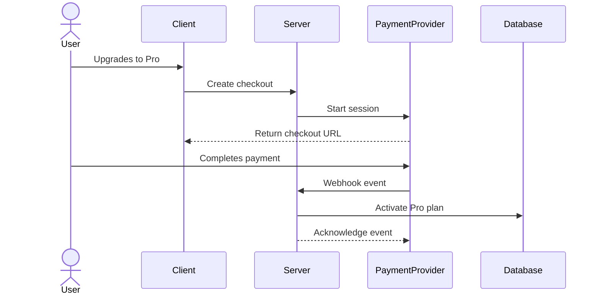
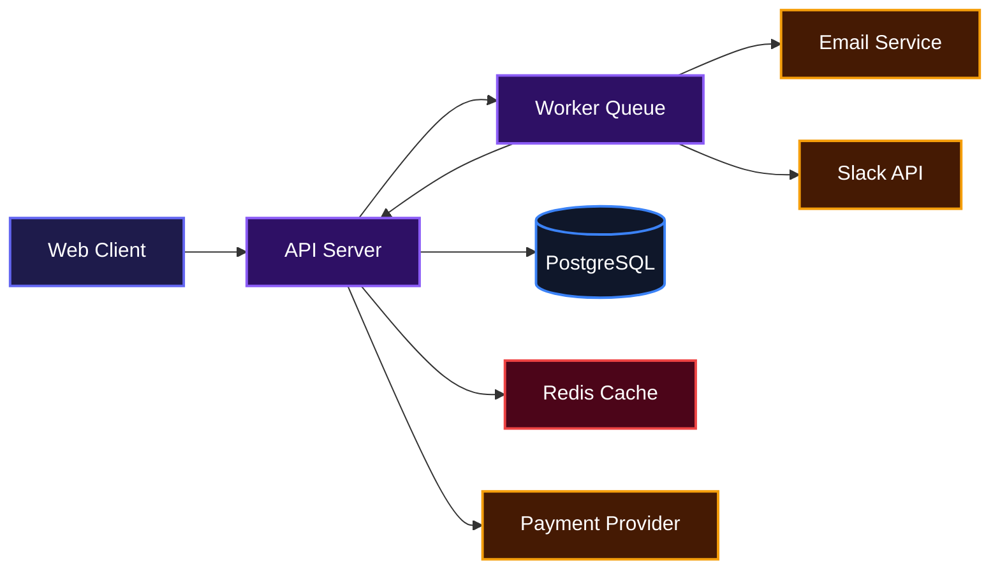

# Clud

## Overview

Clud helps engineering teams catch unexpected changes in their API contracts before those changes break production. It watches OpenAPI and Swagger specifications, compares new versions against saved snapshots, and alerts the right people through Slack or email the moment something drifts. Teams get a shared dashboard where they can see which APIs are in sync, which ones changed, and exactly what changed.

## Description

APIs evolve constantly, and silent contract drift is one of the fastest ways to break a frontend, mobile app, or third-party integration. Clud turns that invisible risk into a visible, actionable workflow. Just point it at your OpenAPI or Swagger spec URL and it starts polling, diffing, and alerting automatically. It is built for teams that want to stop finding out about breaking changes from angry users.

## Installation

### Prerequisites

- Node.js 20 or later
- pnpm 10.5.2 or later
- Docker and Docker Compose (for PostgreSQL and Redis)

### Clone the repository

```bash
git clone git@github.com:samueltuoyo15/Clud.git
cd Clud
```

### Install dependencies

```bash
pnpm install
```

### Set up environment variables

Copy the example files and fill in your values.

```bash
cp apps/client/.env.example apps/client/.env
cp apps/server/.env.example apps/server/.env
```

### Start the database and cache

```bash
docker compose -f compose.yml up -d
```

This starts PostgreSQL on port 5432 and Redis on port 6379.

### Run database migrations

```bash
cd apps/server
pnpm db:migrate
```

### Start the development servers

From the repository root:

```bash
pnpm dev
```

This uses Turbo to start both the client and server in watch mode.

## Usage

Once the project is running, open your browser to the client URL (usually `http://localhost:5173`) and sign up. The onboarding flow will ask for your email, role, and country, then send a six-digit verification code.

After you verify, you land in your workspace dashboard. From there:

1. Add an OpenAPI or Swagger spec URL to start monitoring.
2. Configure alert destinations under Integrations, such as email recipients or Slack.
3. Watch the dashboard update as Clud polls your specs and reports drift.
4. Upgrade to Pro in Settings if you need unlimited specs, Slack alerts, and faster polling.

Example of adding a monitored spec:

```bash
curl -X POST http://localhost:3000/projects \
  -H "Authorization: Bearer <your-token>" \
  -H "Content-Type: application/json" \
  -d '{
    "name": "Payment Gateway",
    "spec_url": "https://api.example.com/openapi.json",
    "check_interval_minutes": 2,
    "auth_type": "none"
  }'
```

## Features

- **Automated OpenAPI and Swagger monitoring**: Add a spec URL once and Clud polls it on a schedule you control.
- **Breaking change detection**: Uses snapshot hashing and diff tooling to detect when endpoints, parameters, or response schemas change.
- **Slack and email alerts**: Route drift notifications to your team's channels and inboxes in real time.
- **Workspace collaboration**: Invite teammates, assign roles, and share a unified dashboard.
- **Magic-link OTP authentication**: Passwordless sign-in with time-limited verification codes.
- **Pro subscriptions**: Upgrade to unlock unlimited projects, Slack integration, and priority polling.
- **Command palette dashboard**: Press Ctrl/Cmd + K to jump between projects, settings, and integrations.
- **Progressive Web App support**: Install Clud as a desktop or mobile app for push alerts.

### Automated Drift Detection and Alerting

When a spec changes, Clud compares the new version to the last stored snapshot. If it finds differences, it sends alerts through every channel your team has configured.



### Magic-Link Authentication

Clud uses a passwordless flow. Users enter their email, receive a six-digit code, and verify it to receive a session token.



### Pro Upgrade and Billing

Workspaces on the free Hobby plan can upgrade to Pro through a checkout session. Payment webhooks update the workspace plan automatically.



## System Architecture

Clud is split into a React client and a NestJS server. The server stores data in PostgreSQL, uses Redis for caching and queues, and dispatches background jobs through BullMQ workers to poll specs and process payments.



## Technologies Used

| Technology | Description | Link |
|---|---|---|
| React | Frontend UI library | [https://react.dev](https://react.dev) |
| TypeScript | Type-safe JavaScript | [https://www.typescriptlang.org](https://www.typescriptlang.org) |
| Vite | Frontend build tool | [https://vitejs.dev](https://vitejs.dev) |
| Tailwind CSS | Utility-first styling | [https://tailwindcss.com](https://tailwindcss.com) |
| NestJS | Backend framework | [https://nestjs.com](https://nestjs.com) |
| Drizzle ORM | TypeScript SQL-like ORM | [https://orm.drizzle.team](https://orm.drizzle.team) |
| PostgreSQL | Relational database | [https://www.postgresql.org](https://www.postgresql.org) |
| Redis | In-memory cache and message broker | [https://redis.io](https://redis.io) |
| BullMQ | Background job queue | [https://bullmq.io](https://bullmq.io) |
| Docker | Containerization | [https://www.docker.com](https://www.docker.com) |
| pnpm | Fast package manager | [https://pnpm.io](https://pnpm.io) |
| Turbo | Monorepo task runner | [https://turbo.build](https://turbo.build) |
| Biome | Linting and formatting | [https://biomejs.dev](https://biomejs.dev) |
| Dodo Payments | Subscription billing | [https://dodopayments.com](https://dodopayments.com) |

## API Documentation

The API is built with NestJS. Most endpoints require authentication via a Bearer token or an HTTP-only cookie. Throttling is applied to auth endpoints.

### Authentication

All auth endpoints are prefixed with `/auth`.

#### POST /auth/signup

Creates a new user account and sends a verification code.

**Request:**

```json
{
  "email": "samuel@company.com",
  "firstName": "Samuel",
  "lastName": "Tuoyo",
  "country": "NG",
  "role": "backend",
  "challenge": "backend-changes"
}
```

**Response:**

```json
{
  "message": "Check your email for a verification code"
}
```

**Errors:**
- 400: Invalid email or missing required field
- 409: An account with this email already exists

#### POST /auth/login

Sends a login OTP to a verified email.

**Request:**

```json
{
  "email": "samuel@company.com"
}
```

**Response:**

```json
{
  "message": "Check your email for a verification code"
}
```

**Errors:**
- 401: Invalid credentials or email not verified

#### POST /auth/resend-otp

Resends the verification code.

**Request:**

```json
{
  "email": "samuel@company.com"
}
```

**Response:**

```json
{
  "message": "A new verification code has been sent to your email"
}
```

**Errors:**
- 401: Invalid credentials

#### POST /auth/verify-otp

Verifies the OTP and returns access and refresh tokens.

**Request:**

```json
{
  "email": "samuel@company.com",
  "code": "123456"
}
```

**Response:**

```json
{
  "message": "Logged in successfully",
  "accessToken": "eyJhbGciOiJIUzI1NiIs...",
  "refreshToken": "eyJhbGciOiJIUzI1NiIs..."
}
```

**Errors:**
- 401: Invalid or expired code

#### POST /auth/refresh

Refreshes the access token using a refresh token from a cookie or the request body.

**Request:**

```json
{
  "refreshToken": "eyJhbGciOiJIUzI1NiIs..."
}
```

**Response:**

```json
{
  "accessToken": "eyJhbGciOiJIUzI1NiIs..."
}
```

**Errors:**
- 401: Refresh token missing or invalid

#### POST /auth/logout

Clears auth cookies.

**Response:**

```json
{
  "message": "Logged out successfully"
}
```

#### GET /auth/me

Returns the current authenticated user.

**Response:**

```json
{
  "id": "uuid",
  "email": "samuel@company.com",
  "first_name": "Samuel",
  "last_name": "Tuoyo",
  "country": "NG",
  "profile_picture": "https://...",
  "account_status": "active",
  "is_onboarded": true,
  "email_verified": true,
  "created_at": "2026-01-01T00:00:00.000Z"
}
```

**Errors:**
- 401: Missing or invalid token

#### PATCH /auth/profile

Updates the current user's profile.

**Request:**

```json
{
  "firstName": "Samuel",
  "lastName": "Tuoyo",
  "profilePicture": "https://example.com/avatar.png"
}
```

**Response:**

```json
{
  "id": "uuid",
  "email": "samuel@company.com",
  "first_name": "Samuel",
  "last_name": "Tuoyo",
  "profile_picture": "https://example.com/avatar.png"
}
```

**Errors:**
- 401: Missing or invalid token

### Projects

All project endpoints are prefixed with `/projects` and require authentication.

#### POST /projects

Creates a new monitored API project.

**Request:**

```json
{
  "name": "Payment Gateway",
  "spec_url": "https://api.example.com/openapi.json",
  "check_interval_minutes": 2,
  "auth_type": "none"
}
```

**Response:**

```json
{
  "id": "uuid",
  "name": "Payment Gateway",
  "spec_url": "https://api.example.com/openapi.json",
  "check_interval_minutes": 2,
  "is_paused": false,
  "auth_type": "none",
  "auth_username": null,
  "last_polled_at": "2026-01-01T00:00:00.000Z",
  "created_at": "2026-01-01T00:00:00.000Z",
  "updated_at": "2026-01-01T00:00:00.000Z"
}
```

**Errors:**
- 400: Invalid URL or missing name
- 401: Unauthorized
- 403: Free plan limited to one project

#### GET /projects

Lists all projects in the user's active workspace.

**Response:**

```json
[
  {
    "id": "uuid",
    "name": "Payment Gateway",
    "spec_url": "https://api.example.com/openapi.json",
    "check_interval_minutes": 2,
    "is_paused": false,
    "auth_type": "none",
    "auth_username": null,
    "drift_detected": false,
    "last_polled_at": "2026-01-01T00:00:00.000Z",
    "created_at": "2026-01-01T00:00:00.000Z",
    "updated_at": "2026-01-01T00:00:00.000Z"
  }
]
```

**Errors:**
- 401: Unauthorized

#### GET /projects/:id

Returns a single project by ID.

**Response:**

```json
{
  "id": "uuid",
  "name": "Payment Gateway",
  "spec_url": "https://api.example.com/openapi.json",
  "check_interval_minutes": 2,
  "is_paused": false,
  "auth_type": "none",
  "auth_username": null,
  "drift_detected": false,
  "last_polled_at": "2026-01-01T00:00:00.000Z",
  "created_at": "2026-01-01T00:00:00.000Z",
  "updated_at": "2026-01-01T00:00:00.000Z"
}
```

**Errors:**
- 401: Unauthorized
- 404: Project not found

#### POST /projects/:id/check

Triggers a manual spec check and returns the diff result.

**Response:**

```json
{
  "changed": true,
  "diff": {
    "breakingChanges": [],
    "nonBreakingChanges": [],
    "unclassifiedChanges": [],
    "breakingChangesFound": false
  }
}
```

**Errors:**
- 401: Unauthorized
- 404: Project not found

### Integrations

All integration endpoints are prefixed with `/integrations` and require authentication.

#### GET /integrations

Returns the current workspace integrations.

**Response:**

```json
{
  "slack": {
    "connected": true,
    "metadata": {
      "team_name": "Acme",
      "channel": "api-alerts"
    }
  },
  "emails": ["samuel@company.com"]
}
```

**Errors:**
- 401: Unauthorized

#### POST /integrations/emails

Saves the email alert recipients for the workspace.

**Request:**

```json
{
  "emails": ["samuel@company.com", "backend@company.com"]
}
```

**Response:**

```json
{
  "success": true
}
```

**Errors:**
- 400: User has no workspace
- 401: Unauthorized

#### POST /integrations/slack

Exchanges a Slack OAuth code for an access token and stores the webhook.

**Request:**

```json
{
  "code": "oauth-code-from-slack",
  "redirect_uri": "https://clud.samueltuoyo.com/dashboard/integrations/slack/callback"
}
```

**Response:**

```json
{
  "success": true,
  "message": "Slack connected successfully"
}
```

**Errors:**
- 400: Missing code, redirect URI, or workspace not on Pro plan
- 401: Unauthorized
- 402: Slack integration requires Pro plan

#### DELETE /integrations/slack

Disconnects Slack from the workspace.

**Response:**

```json
{
  "success": true
}
```

**Errors:**
- 400: User has no workspace
- 401: Unauthorized

### Workspaces

All workspace endpoints are prefixed with `/workspaces` and require authentication.

#### GET /workspaces

Lists workspaces the current user belongs to.

**Response:**

```json
[
  {
    "id": "uuid",
    "name": "Samuel's Workspace",
    "logo_url": null,
    "role": "owner"
  }
]
```

**Errors:**
- 401: Unauthorized

#### POST /workspaces

Creates a new workspace and makes the user the owner.

**Request:**

```json
{
  "name": "Acme Corp"
}
```

**Response:**

```json
{
  "id": "uuid",
  "name": "Acme Corp"
}
```

**Errors:**
- 400: Workspace name is required
- 401: Unauthorized

#### PATCH /workspaces/:id

Updates workspace name or logo.

**Request:**

```json
{
  "name": "Acme Corp",
  "logo_url": "https://example.com/logo.png"
}
```

**Response:**

```json
{
  "id": "uuid",
  "name": "Acme Corp",
  "logo_url": "https://example.com/logo.png"
}
```

**Errors:**
- 400: Only workspace admins can update settings
- 401: Unauthorized
- 404: Workspace not found

#### GET /workspaces/:id/members

Lists members of a workspace.

**Response:**

```json
[
  {
    "id": "uuid",
    "email": "samuel@company.com",
    "first_name": "Samuel",
    "last_name": "Tuoyo",
    "profile_picture": "https://...",
    "role": "owner",
    "created_at": "2026-01-01T00:00:00.000Z"
  }
]
```

**Errors:**
- 400: You do not have access to this workspace
- 401: Unauthorized

#### POST /workspaces/:id/members

Invites an existing Clud user to a workspace by email.

**Request:**

```json
{
  "email": "teammate@company.com"
}
```

**Response:**

```json
{
  "success": true,
  "message": "Member added successfully"
}
```

**Errors:**
- 400: User must create an account first, or already a member, or inviter not admin
- 401: Unauthorized

### Notifications

All notification endpoints are prefixed with `/notifications` and require authentication.

#### GET /notifications

Returns recent in-app notifications for the user's workspace.

**Response:**

```json
[
  {
    "id": "uuid",
    "workspace_id": "uuid",
    "project_id": "uuid",
    "title": "API Drift Detected: Payment Gateway",
    "message": "Schema changes detected...",
    "type": "drift",
    "read": false,
    "created_at": "2026-01-01T00:00:00.000Z"
  }
]
```

**Errors:**
- 401: Unauthorized

#### PATCH /notifications/:id/read

Marks a notification as read.

**Response:**

```json
{
  "success": true
}
```

**Errors:**
- 401: Unauthorized

### Contact

#### POST /contact

Submits a contact or sales inquiry.

**Request:**

```json
{
  "name": "Jane Doe",
  "email": "jane@company.com",
  "company": "Acme Corp",
  "message": "Interested in enterprise deployment."
}
```

**Response:**

```json
{
  "success": true,
  "message": "Your inquiry has been received. We will respond shortly."
}
```

**Errors:**
- 400: Missing required field
- 500: Email service not configured

### Testimonials

#### GET /testimonials

Returns approved testimonials for the landing page.

**Response:**

```json
{
  "success": true,
  "data": [
    {
      "id": "uuid",
      "name": "Sarah Jenkins",
      "handle": "@sarahjenkins",
      "avatar_url": "https://...",
      "quote": "Clud has completely changed how our teams communicate.",
      "role": "Frontend Lead",
      "company": "Fintech",
      "rating": 5,
      "is_approved": true,
      "created_at": "2026-01-01T00:00:00.000Z"
    }
  ]
}
```

#### POST /testimonials

Submits a new testimonial for review.

**Request:**

```json
{
  "name": "Sarah Jenkins",
  "handle": "@sarahjenkins",
  "quote": "Clud catches breaking changes instantly.",
  "role": "Frontend Lead",
  "company": "Fintech",
  "rating": 5
}
```

**Response:**

```json
{
  "success": true,
  "message": "Testimonial submitted successfully.",
  "data": {
    "id": "uuid",
    "name": "Sarah Jenkins"
  }
}
```

**Errors:**
- 400: Missing name or quote, or invalid Twitter handle
- 404: Twitter handle not found

### Payments

All payment endpoints except the webhook are prefixed with `/payments` and require authentication.

#### POST /payments/checkout

Creates a checkout session to upgrade a workspace to Pro.

**Request:**

```json
{
  "workspace_id": "uuid",
  "return_url": "https://clud.samueltuoyo.com/dashboard?billing=success"
}
```

**Response:**

```json
{
  "checkout_url": "https://checkout.dodopayments.com/...",
  "session_id": "sess_..."
}
```

**Errors:**
- 400: Product ID not configured
- 401: Unauthorized
- 404: Workspace not found

#### GET /payments/billing/:workspaceId

Returns billing status for a workspace.

**Response:**

```json
{
  "workspace_id": "uuid",
  "plan": "pro",
  "subscription_status": "active",
  "subscription": {
    "id": "uuid",
    "status": "active",
    "current_period_end": "2026-02-01T00:00:00.000Z"
  }
}
```

**Errors:**
- 401: Unauthorized
- 404: Workspace not found

#### POST /payments/cancel/:workspaceId

Cancels the active Pro subscription for a workspace.

**Response:**

```json
{
  "success": true,
  "message": "Subscription cancelled successfully"
}
```

**Errors:**
- 401: Unauthorized
- 404: Workspace not found

#### POST /payments/webhook

Receives webhook events from Dodo Payments.

**Request:**

```json
{
  "type": "subscription.active",
  "data": {
    "subscription_id": "sub_...",
    "metadata": {
      "workspace_id": "uuid"
    }
  }
}
```

**Response:**

```json
{
  "received": true,
  "event_id": "evt_..."
}
```

**Errors:**
- 400: Invalid webhook signature or missing payload

### Environment Variables

#### Client

| Variable | Description |
|---|---|
| `VITE_API_URL` | Base URL of the backend API |
| `VITE_SLACK_CLIENT_ID` | Slack OAuth client ID |
| `VITE_TESTIMONIAL_SPACE` | Testimonial space identifier |
| `VITE_TESTIMONIAL_API_KEY` | Testimonial API key |

#### Server

| Variable | Description |
|---|---|
| `PORT` | Port the server listens on |
| `DATABASE_URL` | PostgreSQL connection string |
| `REDIS_URL` | Redis connection string |
| `JWT_SECRET` | Secret for signing JWTs |
| `SENDLIB_API_KEY` | API key for the Sendlib email service |
| `SENDLIB_FROM` | Default sender email address |
| `CLIENT_URL` | URL of the client app, used for redirects |
| `SLACK_CLIENT_ID` | Slack OAuth client ID |
| `SLACK_CLIENT_SECRET` | Slack OAuth client secret |
| `DODO_PAYMENTS_API_KEY` | Dodo Payments API key |
| `DODO_PAYMENTS_WEBHOOK_SECRET` | Secret for verifying Dodo webhooks |
| `DODO_PAYMENTS_PRODUCT_ID` | Product ID for the Pro plan |
| `DODO_PAYMENTS_ENVIRONMENT` | `live_mode` or `test_mode` |
| `ENCRYPTION_KEY` | Key for encrypting stored spec credentials |
| `ALLOWED_ORIGINS` | Comma-separated list of CORS origins |
| `NODE_ENV` | `development` or `production` |

## Contributing

Contributions are welcome. To get started:

1. Fork the repository.
2. Create a feature branch.
3. Make your changes and ensure tests pass.
4. Open a pull request with a clear description.

Please keep code style consistent with the existing Biome configuration.

## Author

- GitHub: [https://github.com/samueltuoyo15](https://github.com/samueltuoyo15)
- LinkedIn: [https://linkedin.com/in/samueltuoyo](https://linkedin.com/in/samueltuoyo)
- X: [https://x.com/TuoyoS26091](https://x.com/TuoyoS26091)

## Badges

[](https://www.typescriptlang.org/)
[](https://react.dev/)
[](https://vitejs.dev/)
[](https://tailwindcss.com/)
[](https://nestjs.com/)
[](https://www.postgresql.org/)
[](https://redis.io/)
[](https://www.docker.com/)
[](https://pnpm.io/)
[](https://turbo.build/)

[](https://dokugen.samueltuoyo.com)